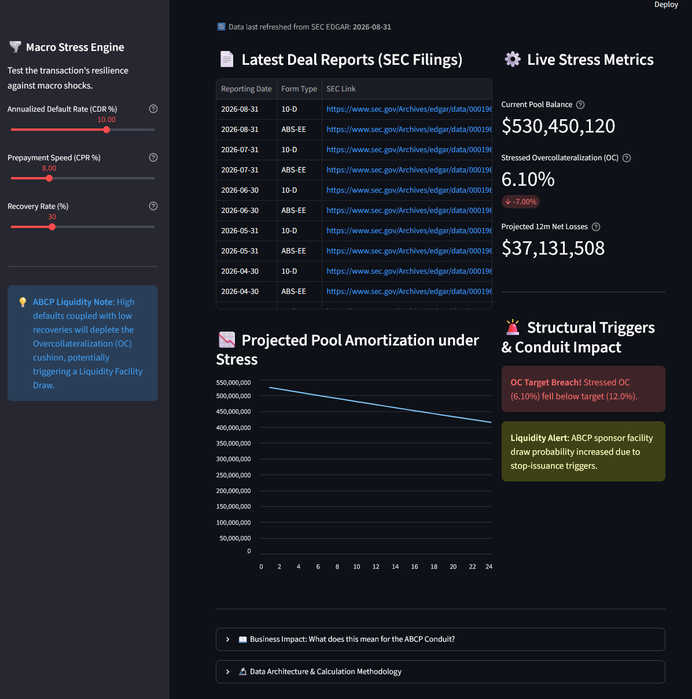

# 🏦 Multi-Seller ABCP Conduit & Auto ABS Digital Twin

[] (https://jeremy-abcp.streamlit.app/) 
*(Click the badge above to view the live interactive dashboard)*

## 📌 Executive Summary
This project is an **Institutional-Grade Structured Finance Surveillance Platform**. It acts as a "Digital Twin" for a public Auto Asset-Backed Securities (ABS) transaction. By programmatically ingesting regulatory filings from the **SEC EDGAR database**, the engine allows credit analysts and structurers to simulate macroeconomic shocks and forecast structural trigger breaches.

---

## 📊 Dashboard Preview & Scenario Analysis
*(A typical stress scenario: Applying a 10% CDR and 30% Recovery Rate to observe the Overcollateralization depletion)*

 
*(See instructions below on how to test the live engine)*

---

## ⚖️ Data Lineage vs. Simulated Assumptions
To ensure financial rigor, the platform strictly separates historical reported data from user-driven stress variables.

**1. Real Market Data (Extracted from SEC EDGAR):**
* **Current Pool Balance:** Derived from the `ABS-EE` (Asset Data) loan-level XML filings.
* **Current Overcollateralization (OC) Ratio & Target OC:** Parsed from the most recent Trustee Distribution Report (`Form 10-D`).

**2. User-Driven Stress Assumptions (Simulation):**
* **CDR (Constant Default Rate):** Annualized percentage of the loan pool expected to default.
* **CPR (Constant Prepayment Rate):** Speed of early principal repayments.
* **Recovery Rate:** The percentage of defaulted balances recovered through vehicle liquidation.

---

## 🔬 Model Assumptions & Limitations
While this engine models the core mechanics of an ABCP conduit funding an ABS pool, it relies on specific structural assumptions:
* **Liquidity Facility Mechanics:** The model assumes that a breach of the Target OC triggers a "Stop-Issuance" or *Early Amortization Event*. For modeling purposes, we assume this event leads to a complete CP market freeze for the conduit, forcing a 100% draw on the Sponsor Bank's backup Liquidity Facility to retire maturing CP notes.
* **Cash Flow Waterfall Simplification:** The stress engine dynamically adjusts the OC cushion based on net losses but does not fully route Yield/Excess Spread through the exact priority of payments (interest vs. principal waterfall) month-by-month.
* **Static Capital Structure:** The capital structure (outstanding senior notes) is considered static at the reporting date for the immediate OC calculation.

---

## ⚙️ Core Features & Architecture
1. **Automated ETL Pipeline:** Connects to the SEC REST API, identifies the latest filings, and uses `xml.etree.ElementTree` for streaming parsing of heavy loan-level XML data without memory overload.
2. **Stress-Testing Engine:** Instantly recalculates the OC ratio and net losses based on user inputs.
3. **Early Warning System:** Flags structural covenant breaches when the stressed OC falls below the indenture's target.

---

## 🚀 How to Run Locally
If you wish to audit the code or run the engine on your local machine:

**1. Clone the repository:**
```bash
git clone [https://github.com/Jaywiss-lab/abcp-surveillance-platform.git](https://github.com/Jaywiss-lab/abcp-surveillance-platform.git)
cd abcp-surveillance-platform
```

**2. Install dependencies:**
```bash
pip install -r requirements.txt
```

**3. Run the ETL pipeline to fetch the latest SEC data:
```bash
python etl_pipeline.py
```

**4. Launch the Streamlit dashboard:
```bash
streamlit run dashboard.py
```

Developed by Jeremy Cassagne | Designed for quantitative risk assessment in Structured Credit, Securitization, and Portfolio Surveillance.


